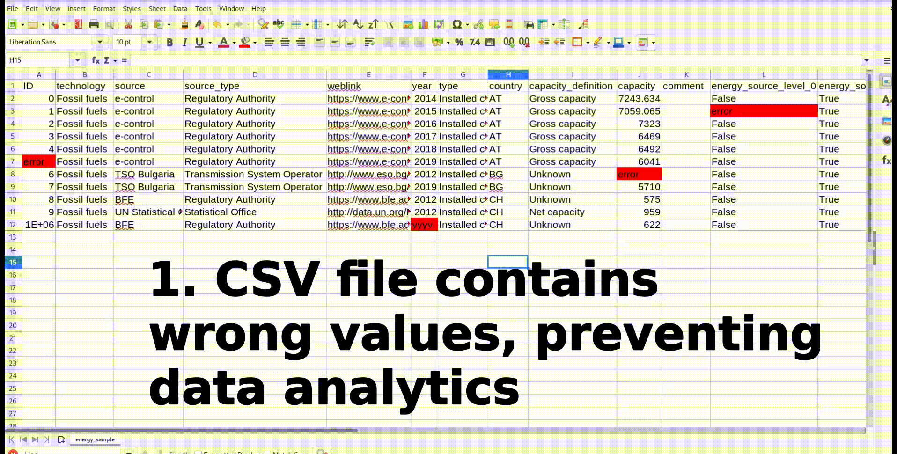

csv-validator
=============

	      
This package outlines an attempt to define a way of thinking about
validating data in tabular format (CSV) similar to its Python
homologue Great Expectations. It's been optimized for performance and
flexibility. It works by defining a set of validations that can be
repeatedly applied to a tabular dataset in CSV format. The validations
are stored in a validation suite that is written entirely in Common
Lisp syntax.

**Features:**

- **Performant**: single core validation speed is ~10MB/s and
  multicore validation speed is ~30MB/s. Please see `Benchmark`_. 
- **Extensible**: validations are written in Common Lisp and stored in
  validation suites. New validations can be easily added.
- **No-nonsense output**: output is a CSV file that contains location
  of values that did not pass the validation, including the erronuous
  value.
- **Well tested**: each validation is unit-tested and builds are
  tested to work on SBCL and ECL.

.. contents:: **Table of Contents**

Installation
---------

This package is in the process of being added to quicklisp. In the
meantime, install as follows:

1. Clone this repository::

     git clone  git@github.com:KoenvdBerg/csv-validator.git

2. Copy the repository to your local quicklisp folder::

     cp -r csv-validator/ ~/quicklisp/local-projects/

3. Open the LISP REPL and run::

     (ql:quickload 'csv-validator)

     # For development load this as well:
     (in-package :csv-validator)

4. Test if installation was succesfull by running::

     (csv-validator:check-not-null "test-value")

   If this returns ``T`` all is right. 

Validating a simple CSV
---------

In the ``data/`` folder the file ``energy_sample.csv`` is
located. This small csv file is used to illustrate how the
csv-validator works.

Let's start with defining a small validation suite and using it to
perform a validation on the ``energy_sample.csv`` data. Open a new
common lisp script and make sure that the csv-validator is correctly
installed. Then define and run::

  (defparameter *test_suite*
   (list
    (list
     :column "ID"			;The column to be validated
     :depends (list "ID")		;The value to use in the logic (see below)
     :label "max-5-chars"		;The text to include in output in case of failed validation
     :logic (lambda (ID)		;The logic for this validation. 
	     (<= (length ID) 5)))))	;The value in the ID column should have 5 or less characters.

  (csv-validator:validate-csv "/path/to/data/energy_sample.csv"
  "/path/to/output/folder/" *test_suite* :delim #\; :threads 1)
	     
Make sure that you include the correct path to the
``energy_sample.csv`` input data and that the output folder that
you're writing to exists. Now open the file named
``csv-validator_validations.csv`` in the output folder and explore the
result::

  index;column;erronuous_value;label
  11;ID;999999;max-5-chars

As you can see the result itself is a CSV file (';' as delimiter). It
correctly points out that the value in the ``ID`` column at index 11
is longer than 5 characters.

Header validations
---------

Header validations are checks if the header row of the CSV file is as
expected. This is especially usefull for data pipelines where the
presence of certain headers in the CSV file is expected. Header
validation will be performed for every validation in your validation
suite. Example::

  (defparameter *test_suite*
   (list
    (list
     :column "ID"			
     :depends (list "ID")		
     :label "max-5-chars"		
     :logic (lambda (ID)			
	     (<= (length ID) 5)))
    (list
     :column "not_existing_column"			
     :depends (list "not_existing_column")		
     :label "max-10-chars"		
     :logic (lambda (x)			
	     (<= (length x) 10)))))

Here a second validation is added to the validation suite that
describes a column that doesn't exist in the data. This will give the
following result after running the validation (through ``csv-validator:validate-csv ...``::

  index;column;erronuous_value;label
  0;not_existing_column;not_existing_column;missing-header
  11;ID;999999;max-5-chars

At index 0 (header row) the error with label "missing-header" shows
up, because this header is not present in the CSV file. Since the
``ID`` column is present, we get the regular output for that column.

Record validations
---------

Record validations are validations that are performed on each record
in the CSV file. The ``csv-validator`` has several build-in
validations, that are unit-tested. However, it's also perfectly
possible to define your own functions or use lambda functions for
validations.

Lambda validations
~~~~~~~~~~~~~

Literally every function can be used as a validation, including lambda
functions. As long as the used function returns a non-nil value for
correct values, and ``nil`` for incorrect values. For example::

  (defparameter *test_suite*
   (list
     (list
       :column "country"
       :depends (list "country")
       :label "not-allowed-country"
       :logic (lambda (x) (position x '("AT" "BG" "CH") :test #'string=)))))

This lambda function validates if the country code is in the allowed
list of country codes (in the file ``energy_sample.csv``). The value
from the column "country" will be used as ``x`` in the lambda function
(as defined under ``:depends``). For example the country code "ES"
will result in an error in the result file like this::

  index;column;erronuous_value;label
  12;country;ES;not-allowed-country

Consider another example::
  
  (defparameter *test_suite*
   (list
     (list
      :column "energy_source_level_0"
      :depends (list "energy_source_level_0")
      :label "true-or-false"
      :logic (lambda (x) (or (string= (string-downcase x) "true")
                             (string= (string-downcase x) "false"))))))

This lambda function validates the "energy_source_0" column and only
allows for string-values "TRUE" or "FALSE", independent of case. The
erronuous value "INVALID" in this column will result in::
  
  index;column;erronuous_value;label
  12;energy_source_level_0;INVALID;true-or-false

  
Conditional validations
~~~~~~~~~~~~~

Conditional validations are validations that are only performed on a
subset of the column that is true for the condition. Using this
concept, it's possible to define validations that are dependent on
values in other columns in the same record. It's best illustrated
using an example. In this example, the column "weblink" cannot have
the value "link unavailable" when the source of the data is "REE"::

  (defparameter *test_suite*
   (list
    (list
     :column "weblink"
     :depends (list "weblink" "source")
     :label "unavailable-not-allowed"
     :logic (lambda (weblink source) (or (not (string= source "REE"))
    					 (not (string= (string-downcase weblink)
						       "link unavailable")))))))

This validation will only check if the value in the "weblink" column
is "link unavailable" when the value in the "source" column is
"REE". It'll give the following output upon running this suite against
the ``energy_example.csv`` file::
  
  index;column;erronuous_value;label
  9;weblink;link unavailable;unavailable-not-allowed

Consider this other example::
  
  (defparameter *test_suite*
   (list
    (list
     :column "capacity"
     :depends (list "capacity")
     :label "number"
     :logic (lambda (x) (or (csv-validator:check-null x)
 			    (csv-validator:check-number-string x))))))

This validation validates if the values in the "capacity" column are
numeric values, but only if these values are non-null values. Thus
values like "null" or "3.14" will pass the validation, but a value
like "ui44" won't (it's not a number). It uses several build-in
validations that will be discussed in the sections below.
  

Numerical validations
~~~~~~~~~~~~~

**Validate integers**

Integer validation can be done using the build-in function:
``csv-validator:check-integer-string``. It works as follows::

  (csv-validator:check-integer-string "54") --> t
  (csv-validator:check-integer-string "1.45") --> nil
  (csv-validator:check-integer-string "-99") --> t
  (csv-validator:check-integer-string "lk93") --> nil

Use it in a validation suite like this::

   (defparameter *test_suite*
    (list
     (list
      :column "capacity"
      :depends (list "capacity")
      :label "expect-integer"
      :logic (lambda (x) (csv-validator:check-integer-string x)))))

**Validate floats**

Float validation can be done using the build-in function:
``csv-validator:check-float-string``. It works as follows::

  (csv-validator:check-float-string "54") --> nil
  (csv-validator:check-float-string "1.45") --> t
  (csv-validator:check-float-string "-99") --> nil
  (csv-validator:check-float-string "lk93") --> nil

Use it in a validation suite like this::

   (defparameter *test_suite*
    (list
     (list
      :column "capacity"
      :depends (list "capacity")
      :label "expect-float"
      :logic (lambda (x) (csv-validator:check-float-string x)))))

**Validate scientific numbers**

Scientific number validation can be done using the build-in function:
``csv-validator:check-scientific-number-string``. It works as follows::

  (csv-validator:check-scientific-number-string "54") --> nil
  (csv-validator:check-scientific-number-string "1.45e10") --> t
  (csv-validator:check-scientific-number-string "-1.2E-1") --> t
  (csv-validator:check-scientific-number-string "lk93") --> nil

Use it in a validation suite like this::

   (defparameter *test_suite*
    (list
     (list
      :column "capacity"
      :depends (list "capacity")
      :label "expect-scientific-number"
      :logic (lambda (x) (csv-validator:check-scientific-number-string x)))))

**Validate numerical values**

Number validation can be done using the build-in function:
``csv-validator:check-number-string``. It works as follows::

  (csv-validator:check-number-string "54") --> t
  (csv-validator:check-number-string "1.45") --> t
  (csv-validator:check-number-string "-1.2E-1") --> t
  (csv-validator:check-number-string "lk93") --> nil

Use it in a validation suite like this::

   (defparameter *test_suite*
    (list
     (list
      :column "capacity"
      :depends (list "capacity")
      :label "expect-numerical-value"
      :logic (lambda (x) (csv-validator:check-number-string x)))))

**Validate if number is within range**

Number in range validation can be done using the build-in function:
``csv-validator:check-number-in-range``. It works as follows::

  (csv-validator:check-number-in-range "23" 0 50) --> t
  (csv-validator:check-number-in-range "3.14" -4 10) --> t
  (csv-validator:check-number-in-range "100" 0 nil) --> t    ; no upper bound
  (csv-validator:check-number-in-range "10" nil 5) --> nil   ; no lower bound
  (csv-validator:check-number-in-range "kldsj" 0 50) --> nil

Use it in a validation suite like this::

   (defparameter *test_suite*
    (list
     (list
      :column "capacity"
      :depends (list "capacity")
      :label "greater-than-zero"
      :logic (lambda (x) (or (csv-validator:check-null x)
			     (csv-validator:check-number-in-range x -1 nil))))

					
Date validations
~~~~~~~~~~~~~

**Validate if value is date**

Date validation can be done using the build-in function:
``csv-validator:check-date-parsable``. It expects dates in the formats
``yyyy-mm-dd`` and ``yyyy-mm-dd hh:mm:ss`` and works as follows::

  (csv-validator:check-date-parsable "2020-01-01") --> t
  (csv-validator:check-date-parsable "2020-01-01 00:00:00") --> t
  (csv-validator:check-date-parsable "2020-02-30") --> nil
  (csv-validator:check-date-parsable "2022/1/1") --> nil  
  (csv-validator:check-date-parsable "lksdjf") --> nil

Use it in a validation suite like this::

   (defparameter *test_suite*
    (list
     (list
      :column "reporting_date"
      :depends (list "reporting_date")
      :label "date-format-yyyy-mm-dd"
      :logic (symbol-function 'csv-validator:check-date-parsable))))   

**Validate if value is timezone date**

Date validation can be done using the build-in function:
``csv-validator:check-tz-parsable``. It expects dates in the format
``yyyy-mm-ddThh:mm:ssZ`` and works as follows::

  (csv-validator:check-date-parsable "2020-01-01") --> nil
  (csv-validator:check-date-parsable "2020-01-01T00:00:00Z") --> t
  (csv-validator:check-date-parsable "2020-02-30") --> nil
  (csv-validator:check-date-parsable "2022/1/1") --> nil  
  (csv-validator:check-date-parsable "lksdjf") --> nil

Use it in a validation suite like this::

   (defparameter *test_suite*
    (list
     (list
      :column "reporting_date"
      :depends (list "reporting_date")
      :label "date-format-yyyy-mm-ddThh:mm:ssZ"
      :logic (symbol-function 'csv-validator:check-tz-parsable))))

**Validate if date is not in future**

To validate if a date is not in the future, use the build-in function:
``csv-validator:check-date-before-today``. It expects dates in the
format ``yyyy-mm-dd`` and works as follows::

  (csv-validator:check-date-parsable "2020-01-01") --> t
  (csv-validator:check-date-parsable "2023-01-20") --> t
  (csv-validator:check-date-parsable "2028-11-20") --> nil
  (csv-validator:check-date-parsable "klsd") --> ignored
  (csv-validator:check-date-parsable "2023/01/20") --> ignored
  
Use it in a validation suite like this::

   (defparameter *test_suite*
    (list
     (list
      :column "reporting_date"
      :depends (list "reporting_date")
      :label "date-format-yyyy-mm-ddThh:mm:ssZ"
      :logic (symbol-function 'csv-validator:check-date-before-today))))
					     
**Validate if date A is greater than date B**

To validate if a date A is greater than date B, use the build-in function:
``csv-validator:check-compare-two-dates``. It expects dates in the
format ``yyyy-mm-dd`` and works as follows::

  (csv-validator:check-compare-two-dates "2022-02-02" "2022-03-03") --> nil
  (csv-validator:check-compare-two-dates "2022-12-02" "1999-03-03") --> t
  (csv-validator:check-compare-two-dates "ksd" "nkdsl") --> ignored
  
Use it in a validation suite like this::

   (defparameter *test_suite*
    (list
     (list
      :column "date_col_A"
      :depends (list "date_col_A" "date_col_B")
      :label "date_A > date_B"
      :logic (lambda (date-A date-B) (csv-validator:check-compare-two-dates date-A date-B)))))

Missing data validations
~~~~~~~~~~~~~

Missing value validation can be done using the build-in functions:
``csv-validator:check-null`` and ``csv-validator:check-not-null``. They
work as follows::

  (csv-validator:check-null "1.23") -> nil
  (csv-validator:check-null "NA") -> t
  (csv-validator:check-null "klsdjfkl") -> nil
  (csv-validator:check-null "") -> t

  (csv-validator:check-not-null "1.23") -> t
  (csv-validator:check-not-null "NA") -> nil
  (csv-validator:check-not-null "klsdjfkl") -> t
  (csv-validator:check-not-null "") -> nil

Use it in a validation suite like this::

   ;; validates column for missing values
   (defparameter *test_suite*
    (list
     (list
      :column "ID"
      :depends (list "ID")
      :label "ID-not-missing"
      :logic (lambda (x) (csv-validator:check-not-null x)))))

Example validation suite
~~~~~~~~~~~~~

Below the validation suite used to validate the energy data::

  (defparameter *energy_suite*
  (list
   (list
    :column "ID"
    :depends (list "ID")
    :label "integer"
    :logic (symbol-function 'csv-validator:check-integer-string))
   (list
    :column "technology"
    :depends (list "technology")
    :label "string-length"
    :logic (lambda (x) (< (length x) 50)))
   (list
    :column "source"
    :depends (list "source")
    :label "not-null"
    :logic (symbol-function 'csv-validator:check-not-null))
   (list
    :column "source_type"
    :depends (list "source_type")
    :label "not-null"
    :logic (symbol-function 'csv-validator:check-not-null))
   (list
    :column "source"
    :depends (list "source")
    :label "not-null"
    :logic (symbol-function 'csv-validator:check-not-null))
   (list
    :column "weblink"
    :depends (list "weblink" "source")
    :label "unavailable-not-allowed"
    :logic (lambda (weblink source) (or (not (string= source "REE"))
					(not (string= (string-downcase weblink)
						      "link unavailable")))))
   (list
    :column "year"
    :depends (list "year")
    :label "integer-YYYY"
    :logic (lambda (x) (and (= (length x) 4)
			    (csv-validator:check-integer-string x))))
   (list
    :column "country"
    :depends (list "country")
    :label "not-allowed-country"
    :logic (lambda (x) (position x '("AL" "AT" "BA" "BE" "BG" "CH" "CY" "CZ" "DE" "DK" "EE" "ES" "FI" "FR" "GB" "GE" "GR" "HR" "HU" "IE" "IS" "IT" "LT" "LU" "LV" "MD" "ME" "MK" "MT" "NI" "NL" "NO" "PL" "PT" "RO" "RS" "SE" "SI" "SK" "TR" "UA" "XK") :test #'string=)))
   (list
    :column "capacity"
    :depends (list "capacity")
    :label "number"
    :logic (lambda (x) (or (csv-validator:check-null x)
			   (csv-validator:check-number-string x))))
   (list
    :column "capacity"
    :depends (list "capacity")
    :label "greater-than-zero"
    :logic (lambda (x) (or (csv-validator:check-null x)
			   (csv-validator:check-number-in-range x -1 nil))))
					       

   (list
    :column "capacity_definition"
    :depends (list "capacity_definition")
    :label "missing-category"
    :logic (lambda (x) (let ((lowercase-x (string-downcase x)))
			 (or (string= lowercase-x "gross capacity")
			     (string= lowercase-x "net capacity")
			     (string= lowercase-x "unknown")))))
   
   (list
    :column "energy_source_level_0"
    :depends (list "energy_source_level_0")
    :label "true-or-false"
    :logic (lambda (x) (or (string= (string-downcase x) "true")
			   (string= (string-downcase x) "false"))))
   (list
    :column "energy_source_level_1"
    :depends (list "energy_source_level_0")
    :label "true-or-false"
    :logic (lambda (x) (or (string= (string-downcase x) "true")
			   (string= (string-downcase x) "false"))))
   (list
    :column "energy_source_level_2"
    :depends (list "energy_source_level_0")
    :label "true-or-false"
    :logic (lambda (x) (or (string= (string-downcase x) "true")
			   (string= (string-downcase x) "false"))))
   (list
    :column "energy_source_level_3"
    :depends (list "energy_source_level_0")
    :label "true-or-false"
    :logic (lambda (x) (or (string= (string-downcase x) "true")
			   (string= (string-downcase x) "false"))))
   (list
    :column "technology_level"
    :depends (list "technology_level")
    :label "true-or-false"
    :logic (lambda (x) (or (string= (string-downcase x) "true")
			   (string= (string-downcase x) "false"))))
   (list
    :column "reporting_date"
    :depends (list "reporting_date")
    :label "date-not-in-future"
    :logic (symbol-function 'csv-validator:check-date-before-today))
   (list
    :column "reporting_date"
    :depends (list "reporting_date")
    :label "date-format-yyyy-mm-dd"
    :logic (symbol-function 'csv-validator:check-date-parsable))))

Benchmark
---------

This benchmark was performed using:

+---------------------+-----------------------------------------------------------------------+
| CPU                 | AMD Ryzen™ 7 PRO 6850U with Radeon™ Graphics × 16                     |
+---------------------+-----------------------------------------------------------------------+
| LISP implementation | SBCL 2.2.11                                                           |
+---------------------+-----------------------------------------------------------------------+
| OS                  | Fedora Linux 37 (Workstation Edition)                                 |
+---------------------+-----------------------------------------------------------------------+
|                     | name: National generation capacity                                    |
|                     +-----------------------------------------------------------------------+
|                     | description: Aggregated generation capacity by technology and country |
| Dataset             +-----------------------------------------------------------------------+
|                     | consulted on: 2023-01-24                                              |
|                     +-----------------------------------------------------------------------+
|                     | link: source_                                                         |
+---------------------+-----------------------------------------------------------------------+

Csv-files with filesizes up to 200MB were validated using a validation
suite with 18 or 36 validations and using 1 core or 4 cores. Each
combination was sampled three times and averaged thereafter. The
results are shown in the table below:

+---------------+---------------------------------------------+
| filesize (MB) | time (s)                                    |
|               +----------------------+----------------------+
|               | 18 validations       | 36 validations       |
|               +----------+-----------+----------+-----------+
|               | 1 thread | 4 threads | 1 thread | 4 threads |
+===============+==========+===========+==========+===========+
| 0.0032        | 0.009    | 0.015     | 0.011    | 0.018     |
+---------------+----------+-----------+----------+-----------+
| 0.026         | 0.009    | 0.012     | 0.009    | 0.014     |
+---------------+----------+-----------+----------+-----------+
| 0.2754        | 0.019    | 0.019     | 0.029    | 0.021     |
+---------------+----------+-----------+----------+-----------+
| 1.8           | 0.122    | 0.062     | 0.205    | 0.090     |
+---------------+----------+-----------+----------+-----------+
| 6.8           | 0.428    | 0.185     | 0.748    | 0.289     |
+---------------+----------+-----------+----------+-----------+
| 13.6          | 0.838    | 0.349     | 1.466    | 0.540     |
+---------------+----------+-----------+----------+-----------+
| 109.2         | 6.623    | 2.369     | 11.765   | 3.846     |
+---------------+----------+-----------+----------+-----------+
| 218.4         | 13.259   | 4.712     | 23.908   | 7.647     |
+---------------+----------+-----------+----------+-----------+

Next the average speed (in MB/s) was calculated skipping filesizes
lower than 1MB. The table below shows the results:

+---------------+----------------------+
|               | average speed (MB/s) |
| n validations +----------+-----------+
|               | 1 thread | 4 threads |
+===============+==========+===========+
| 18            | 15.971   | 39.432    |
+---------------+----------+-----------+
| 36            | 9.109    | 25.139    |
+---------------+----------+-----------+

*Conclusions*

- For file sizes up to 1MB it doesn't make sense to run the
  csv-validator using multiple threads.
- The more validations are applied to the csv data, the slower the
  csv-validator is.

Contributing
---------

Feel free to create a pull-request on this code-base. Please make sure
that all the tests pass (run: ``make test``) and add new tests for new
validations

Code repository has been created using cookiecutter with template:
https://github.com/vindarel/cl-cookieproject.

.. _source: https://data.open-power-system-data.org/national_generation_capacity/2020-10-01
